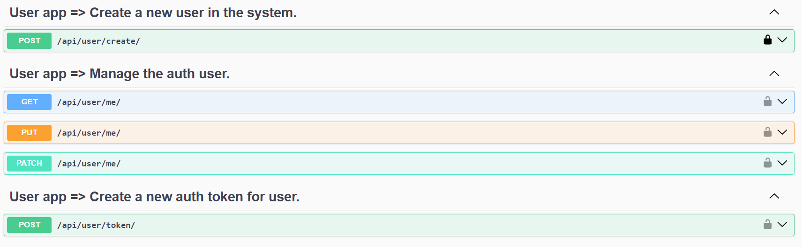
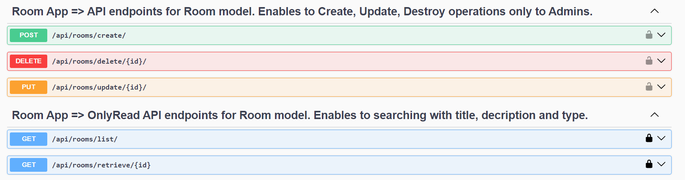

# Description

This project includes a hotel reservation application. Django REST Framework has been used for the backend processes of the project.

## Backend

The API endpoints are created using Django REST Framework. The project consists of 4 different Django applications:

* core: This application defines the models used in the project. The models are registered to be displayed on the admin page. The application also includes a command file containing code to update room availabilities, and a signals.py file defining the creation of a user associated with a user object after creating a user instance.

* user: This application handles user validation and token generation processes.

* room: This application contains validation and business logic related to hotel rooms.

* reservation: This application includes validation and business logic related to reservation processes.

### API Endpoints

* User api endpoints
  

* Room api endpoints

* Reservation api endpoints

